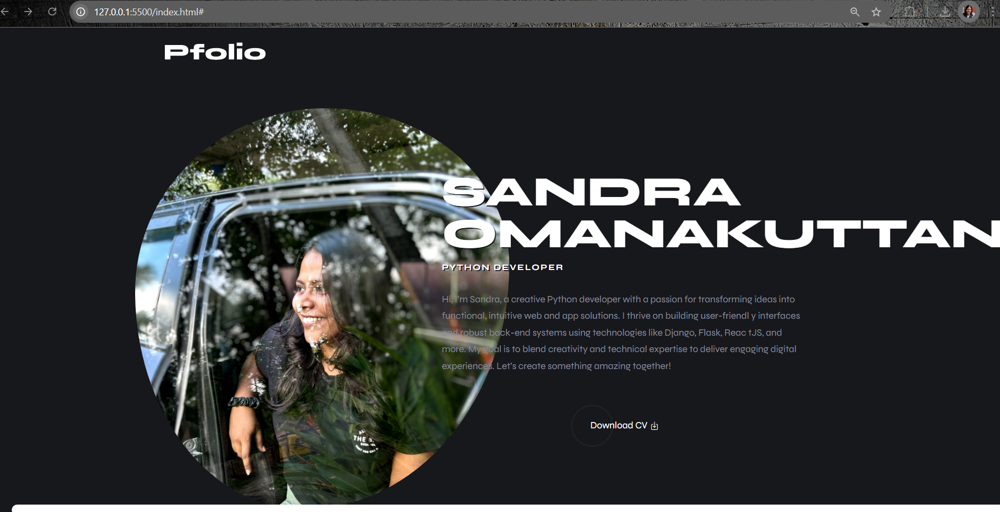

# Portfolio Website for Sandra Ko

This is a portfolio website created for Sandra Ko, showcasing her skills, projects, and resume. It includes sections for front-end and back-end development services, a downloadable resume, and social media links for networking.


## About

This website serves as a personal portfolio to display Sandra Ko's work, including her web and app development skills, certifications, and featured projects.

## Features
- Responsive design for optimal viewing on any device.
- Includes sections for skills, certifications, and projects.
- Downloadable resume feature.
- Integrated social media icons with links to GitHub and LinkedIn.
- Detailed information about provided services.


### Installation

1. Clone the repo:
    ```bash
    git clone https://github.com/sandraomanakuttan/portfolio.git
    ```

2. Navigate to the project folder:
    ```bash
    cd portfolio
    ```

3. Start a local server:
    ```bash
    python3 -m http.server
    ```

4. Visit `http://localhost:8000` in your browser to view the website.


## Screenshots


*Caption: Homepage of the Portfolio Website.*

!

_**Note**: Replace the paths above with the actual paths to your screenshot files._

## Technologies Used

- HTML5
- CSS3
- JavaScript (for interactivity)
- Bootstrap (for responsiveness)
- Python (for running a local server)
- Ionicons (for social media icons)

## Contact

Sandra Ko – [LinkedIn](https://linkedin.com/in/sandra-k-o-b594b9278/) 
– [GitHub](https://github.com/sandraomanakuttan)

Project Link: [Portfolio Website](https://github.com/sandraomanakuttan/portfolio)

